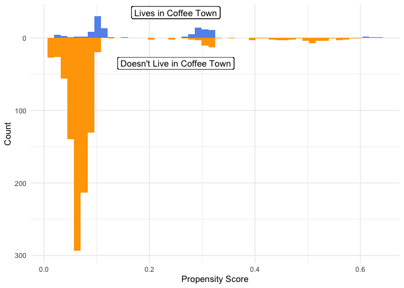
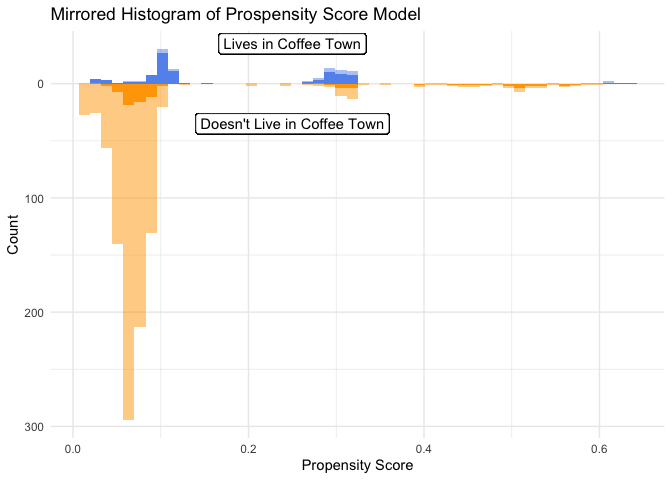
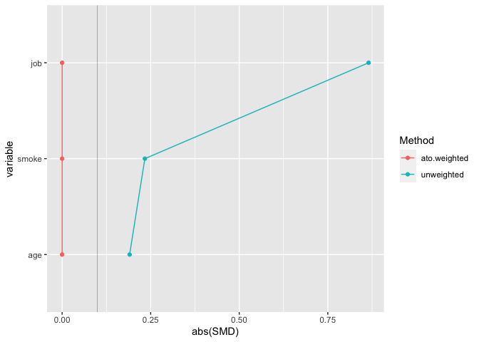
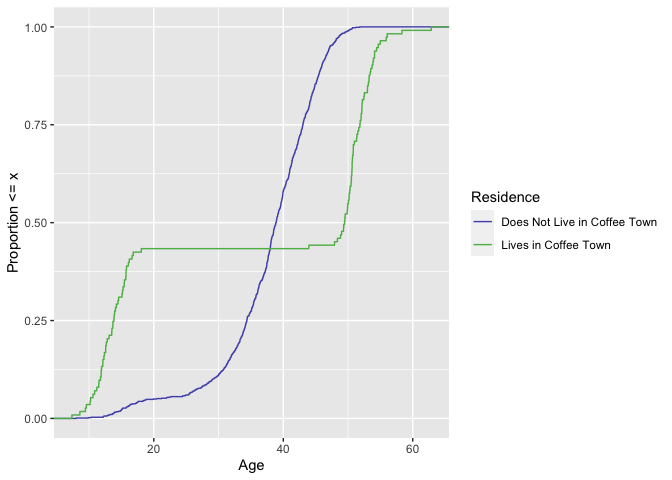
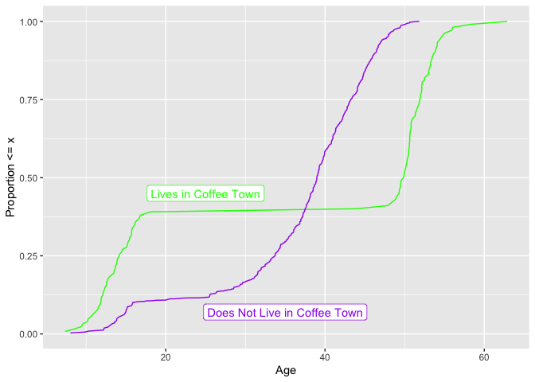
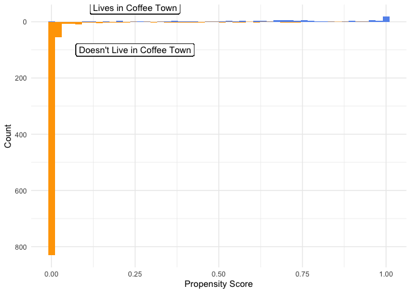
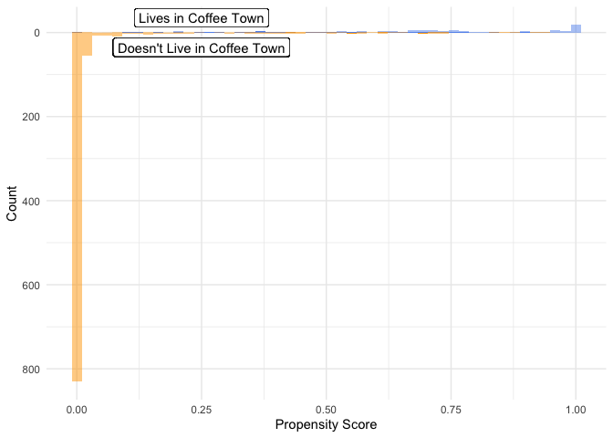
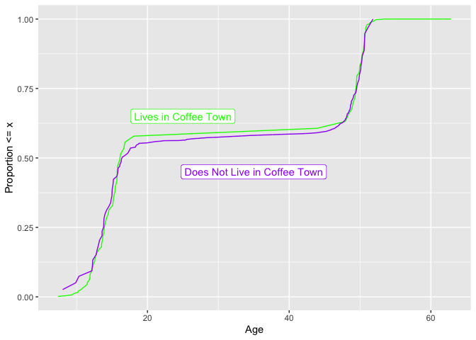

Lab 03 - Using Propensity Scores
================
Gwyneth Terrett
2022-03-29

``` r
library(tidyverse)
library(smd)
library(gtsummary)
library(MatchIt)
library(broom)
```

## Exercise 1

``` r
coffee_town_df <- read_csv("coffee_town_df.csv")
```

    ## Rows: 1100 Columns: 5
    ## ── Column specification ────────────────────────────────────────────────────────
    ## Delimiter: ","
    ## chr (2): job, smoke
    ## dbl (3): coffee_town, cups_of_coffee, age
    ## 
    ## ℹ Use `spec()` to retrieve the full column specification for this data.
    ## ℹ Specify the column types or set `show_col_types = FALSE` to quiet this message.

``` r
head(coffee_town_df)
```

    ## # A tibble: 6 × 5
    ##   coffee_town cups_of_coffee   age job   smoke
    ##         <dbl>          <dbl> <dbl> <chr> <chr>
    ## 1           1              0  12.1 none  never
    ## 2           0              0  14.6 none  never
    ## 3           1              0  11.5 none  never
    ## 4           0              1  18.8 easy  never
    ## 5           0              0  15.0 none  never
    ## 6           1              0  11.5 none  never

There are five variables in our data frame. The response variable
coffee\_town is binary, 1 indicating that the individual lives in Coffee
Town and 0 indicating that the individual does not live in Coffee Town.
Furthermore, our data frame includes four explanatory variables, two of
which are quantitative and the other two categorical. We have a total of
1100 observations, and there are no missing entries in our data frame.

``` r
table(coffee_town_df$coffee_town)
```

    ## 
    ##   0   1 
    ## 987 113

987 of our observed individuals do NOT live in Coffee Town, and the
remaining 113 do.

## Exercise 2

``` r
coffee_town_df %>% 
  tbl_summary(
    by = coffee_town,
    include = c("cups_of_coffee","age","job","smoke")) %>%
  add_overall()
```

<div id="hldpmjhmnw" style="overflow-x:auto;overflow-y:auto;width:auto;height:auto;">
<style>html {
  font-family: -apple-system, BlinkMacSystemFont, 'Segoe UI', Roboto, Oxygen, Ubuntu, Cantarell, 'Helvetica Neue', 'Fira Sans', 'Droid Sans', Arial, sans-serif;
}

#hldpmjhmnw .gt_table {
  display: table;
  border-collapse: collapse;
  margin-left: auto;
  margin-right: auto;
  color: #333333;
  font-size: 16px;
  font-weight: normal;
  font-style: normal;
  background-color: #FFFFFF;
  width: auto;
  border-top-style: solid;
  border-top-width: 2px;
  border-top-color: #A8A8A8;
  border-right-style: none;
  border-right-width: 2px;
  border-right-color: #D3D3D3;
  border-bottom-style: solid;
  border-bottom-width: 2px;
  border-bottom-color: #A8A8A8;
  border-left-style: none;
  border-left-width: 2px;
  border-left-color: #D3D3D3;
}

#hldpmjhmnw .gt_heading {
  background-color: #FFFFFF;
  text-align: center;
  border-bottom-color: #FFFFFF;
  border-left-style: none;
  border-left-width: 1px;
  border-left-color: #D3D3D3;
  border-right-style: none;
  border-right-width: 1px;
  border-right-color: #D3D3D3;
}

#hldpmjhmnw .gt_title {
  color: #333333;
  font-size: 125%;
  font-weight: initial;
  padding-top: 4px;
  padding-bottom: 4px;
  padding-left: 5px;
  padding-right: 5px;
  border-bottom-color: #FFFFFF;
  border-bottom-width: 0;
}

#hldpmjhmnw .gt_subtitle {
  color: #333333;
  font-size: 85%;
  font-weight: initial;
  padding-top: 0;
  padding-bottom: 6px;
  padding-left: 5px;
  padding-right: 5px;
  border-top-color: #FFFFFF;
  border-top-width: 0;
}

#hldpmjhmnw .gt_bottom_border {
  border-bottom-style: solid;
  border-bottom-width: 2px;
  border-bottom-color: #D3D3D3;
}

#hldpmjhmnw .gt_col_headings {
  border-top-style: solid;
  border-top-width: 2px;
  border-top-color: #D3D3D3;
  border-bottom-style: solid;
  border-bottom-width: 2px;
  border-bottom-color: #D3D3D3;
  border-left-style: none;
  border-left-width: 1px;
  border-left-color: #D3D3D3;
  border-right-style: none;
  border-right-width: 1px;
  border-right-color: #D3D3D3;
}

#hldpmjhmnw .gt_col_heading {
  color: #333333;
  background-color: #FFFFFF;
  font-size: 100%;
  font-weight: normal;
  text-transform: inherit;
  border-left-style: none;
  border-left-width: 1px;
  border-left-color: #D3D3D3;
  border-right-style: none;
  border-right-width: 1px;
  border-right-color: #D3D3D3;
  vertical-align: bottom;
  padding-top: 5px;
  padding-bottom: 6px;
  padding-left: 5px;
  padding-right: 5px;
  overflow-x: hidden;
}

#hldpmjhmnw .gt_column_spanner_outer {
  color: #333333;
  background-color: #FFFFFF;
  font-size: 100%;
  font-weight: normal;
  text-transform: inherit;
  padding-top: 0;
  padding-bottom: 0;
  padding-left: 4px;
  padding-right: 4px;
}

#hldpmjhmnw .gt_column_spanner_outer:first-child {
  padding-left: 0;
}

#hldpmjhmnw .gt_column_spanner_outer:last-child {
  padding-right: 0;
}

#hldpmjhmnw .gt_column_spanner {
  border-bottom-style: solid;
  border-bottom-width: 2px;
  border-bottom-color: #D3D3D3;
  vertical-align: bottom;
  padding-top: 5px;
  padding-bottom: 5px;
  overflow-x: hidden;
  display: inline-block;
  width: 100%;
}

#hldpmjhmnw .gt_group_heading {
  padding-top: 8px;
  padding-bottom: 8px;
  padding-left: 5px;
  padding-right: 5px;
  color: #333333;
  background-color: #FFFFFF;
  font-size: 100%;
  font-weight: initial;
  text-transform: inherit;
  border-top-style: solid;
  border-top-width: 2px;
  border-top-color: #D3D3D3;
  border-bottom-style: solid;
  border-bottom-width: 2px;
  border-bottom-color: #D3D3D3;
  border-left-style: none;
  border-left-width: 1px;
  border-left-color: #D3D3D3;
  border-right-style: none;
  border-right-width: 1px;
  border-right-color: #D3D3D3;
  vertical-align: middle;
}

#hldpmjhmnw .gt_empty_group_heading {
  padding: 0.5px;
  color: #333333;
  background-color: #FFFFFF;
  font-size: 100%;
  font-weight: initial;
  border-top-style: solid;
  border-top-width: 2px;
  border-top-color: #D3D3D3;
  border-bottom-style: solid;
  border-bottom-width: 2px;
  border-bottom-color: #D3D3D3;
  vertical-align: middle;
}

#hldpmjhmnw .gt_from_md > :first-child {
  margin-top: 0;
}

#hldpmjhmnw .gt_from_md > :last-child {
  margin-bottom: 0;
}

#hldpmjhmnw .gt_row {
  padding-top: 8px;
  padding-bottom: 8px;
  padding-left: 5px;
  padding-right: 5px;
  margin: 10px;
  border-top-style: solid;
  border-top-width: 1px;
  border-top-color: #D3D3D3;
  border-left-style: none;
  border-left-width: 1px;
  border-left-color: #D3D3D3;
  border-right-style: none;
  border-right-width: 1px;
  border-right-color: #D3D3D3;
  vertical-align: middle;
  overflow-x: hidden;
}

#hldpmjhmnw .gt_stub {
  color: #333333;
  background-color: #FFFFFF;
  font-size: 100%;
  font-weight: initial;
  text-transform: inherit;
  border-right-style: solid;
  border-right-width: 2px;
  border-right-color: #D3D3D3;
  padding-left: 5px;
  padding-right: 5px;
}

#hldpmjhmnw .gt_stub_row_group {
  color: #333333;
  background-color: #FFFFFF;
  font-size: 100%;
  font-weight: initial;
  text-transform: inherit;
  border-right-style: solid;
  border-right-width: 2px;
  border-right-color: #D3D3D3;
  padding-left: 5px;
  padding-right: 5px;
  vertical-align: top;
}

#hldpmjhmnw .gt_row_group_first td {
  border-top-width: 2px;
}

#hldpmjhmnw .gt_summary_row {
  color: #333333;
  background-color: #FFFFFF;
  text-transform: inherit;
  padding-top: 8px;
  padding-bottom: 8px;
  padding-left: 5px;
  padding-right: 5px;
}

#hldpmjhmnw .gt_first_summary_row {
  border-top-style: solid;
  border-top-color: #D3D3D3;
}

#hldpmjhmnw .gt_first_summary_row.thick {
  border-top-width: 2px;
}

#hldpmjhmnw .gt_last_summary_row {
  padding-top: 8px;
  padding-bottom: 8px;
  padding-left: 5px;
  padding-right: 5px;
  border-bottom-style: solid;
  border-bottom-width: 2px;
  border-bottom-color: #D3D3D3;
}

#hldpmjhmnw .gt_grand_summary_row {
  color: #333333;
  background-color: #FFFFFF;
  text-transform: inherit;
  padding-top: 8px;
  padding-bottom: 8px;
  padding-left: 5px;
  padding-right: 5px;
}

#hldpmjhmnw .gt_first_grand_summary_row {
  padding-top: 8px;
  padding-bottom: 8px;
  padding-left: 5px;
  padding-right: 5px;
  border-top-style: double;
  border-top-width: 6px;
  border-top-color: #D3D3D3;
}

#hldpmjhmnw .gt_striped {
  background-color: rgba(128, 128, 128, 0.05);
}

#hldpmjhmnw .gt_table_body {
  border-top-style: solid;
  border-top-width: 2px;
  border-top-color: #D3D3D3;
  border-bottom-style: solid;
  border-bottom-width: 2px;
  border-bottom-color: #D3D3D3;
}

#hldpmjhmnw .gt_footnotes {
  color: #333333;
  background-color: #FFFFFF;
  border-bottom-style: none;
  border-bottom-width: 2px;
  border-bottom-color: #D3D3D3;
  border-left-style: none;
  border-left-width: 2px;
  border-left-color: #D3D3D3;
  border-right-style: none;
  border-right-width: 2px;
  border-right-color: #D3D3D3;
}

#hldpmjhmnw .gt_footnote {
  margin: 0px;
  font-size: 90%;
  padding-left: 4px;
  padding-right: 4px;
  padding-left: 5px;
  padding-right: 5px;
}

#hldpmjhmnw .gt_sourcenotes {
  color: #333333;
  background-color: #FFFFFF;
  border-bottom-style: none;
  border-bottom-width: 2px;
  border-bottom-color: #D3D3D3;
  border-left-style: none;
  border-left-width: 2px;
  border-left-color: #D3D3D3;
  border-right-style: none;
  border-right-width: 2px;
  border-right-color: #D3D3D3;
}

#hldpmjhmnw .gt_sourcenote {
  font-size: 90%;
  padding-top: 4px;
  padding-bottom: 4px;
  padding-left: 5px;
  padding-right: 5px;
}

#hldpmjhmnw .gt_left {
  text-align: left;
}

#hldpmjhmnw .gt_center {
  text-align: center;
}

#hldpmjhmnw .gt_right {
  text-align: right;
  font-variant-numeric: tabular-nums;
}

#hldpmjhmnw .gt_font_normal {
  font-weight: normal;
}

#hldpmjhmnw .gt_font_bold {
  font-weight: bold;
}

#hldpmjhmnw .gt_font_italic {
  font-style: italic;
}

#hldpmjhmnw .gt_super {
  font-size: 65%;
}

#hldpmjhmnw .gt_footnote_marks {
  font-style: italic;
  font-weight: normal;
  font-size: 75%;
  vertical-align: 0.4em;
}

#hldpmjhmnw .gt_asterisk {
  font-size: 100%;
  vertical-align: 0;
}

#hldpmjhmnw .gt_slash_mark {
  font-size: 0.7em;
  line-height: 0.7em;
  vertical-align: 0.15em;
}

#hldpmjhmnw .gt_fraction_numerator {
  font-size: 0.6em;
  line-height: 0.6em;
  vertical-align: 0.45em;
}

#hldpmjhmnw .gt_fraction_denominator {
  font-size: 0.6em;
  line-height: 0.6em;
  vertical-align: -0.05em;
}
</style>
<table class="gt_table">
  
  <thead class="gt_col_headings">
    <tr>
      <th class="gt_col_heading gt_columns_bottom_border gt_left" rowspan="1" colspan="1"><strong>Characteristic</strong></th>
      <th class="gt_col_heading gt_columns_bottom_border gt_center" rowspan="1" colspan="1"><strong>Overall</strong>, N = 1,100<sup class="gt_footnote_marks">1</sup></th>
      <th class="gt_col_heading gt_columns_bottom_border gt_center" rowspan="1" colspan="1"><strong>0</strong>, N = 987<sup class="gt_footnote_marks">1</sup></th>
      <th class="gt_col_heading gt_columns_bottom_border gt_center" rowspan="1" colspan="1"><strong>1</strong>, N = 113<sup class="gt_footnote_marks">1</sup></th>
    </tr>
  </thead>
  <tbody class="gt_table_body">
    <tr><td class="gt_row gt_left">cups_of_coffee</td>
<td class="gt_row gt_center"></td>
<td class="gt_row gt_center"></td>
<td class="gt_row gt_center"></td></tr>
    <tr><td class="gt_row gt_left" style="text-align: left; text-indent: 10px;">0</td>
<td class="gt_row gt_center">92 (8.4%)</td>
<td class="gt_row gt_center">43 (4.4%)</td>
<td class="gt_row gt_center">49 (43%)</td></tr>
    <tr><td class="gt_row gt_left" style="text-align: left; text-indent: 10px;">1</td>
<td class="gt_row gt_center">104 (9.5%)</td>
<td class="gt_row gt_center">104 (11%)</td>
<td class="gt_row gt_center">0 (0%)</td></tr>
    <tr><td class="gt_row gt_left" style="text-align: left; text-indent: 10px;">2</td>
<td class="gt_row gt_center">461 (42%)</td>
<td class="gt_row gt_center">461 (47%)</td>
<td class="gt_row gt_center">0 (0%)</td></tr>
    <tr><td class="gt_row gt_left" style="text-align: left; text-indent: 10px;">3</td>
<td class="gt_row gt_center">352 (32%)</td>
<td class="gt_row gt_center">350 (35%)</td>
<td class="gt_row gt_center">2 (1.8%)</td></tr>
    <tr><td class="gt_row gt_left" style="text-align: left; text-indent: 10px;">4</td>
<td class="gt_row gt_center">86 (7.8%)</td>
<td class="gt_row gt_center">29 (2.9%)</td>
<td class="gt_row gt_center">57 (50%)</td></tr>
    <tr><td class="gt_row gt_left" style="text-align: left; text-indent: 10px;">5</td>
<td class="gt_row gt_center">4 (0.4%)</td>
<td class="gt_row gt_center">0 (0%)</td>
<td class="gt_row gt_center">4 (3.5%)</td></tr>
    <tr><td class="gt_row gt_left" style="text-align: left; text-indent: 10px;">6</td>
<td class="gt_row gt_center">1 (&lt;0.1%)</td>
<td class="gt_row gt_center">0 (0%)</td>
<td class="gt_row gt_center">1 (0.9%)</td></tr>
    <tr><td class="gt_row gt_left">age</td>
<td class="gt_row gt_center">39 (34, 44)</td>
<td class="gt_row gt_center">39 (34, 43)</td>
<td class="gt_row gt_center">49 (14, 52)</td></tr>
    <tr><td class="gt_row gt_left">job</td>
<td class="gt_row gt_center"></td>
<td class="gt_row gt_center"></td>
<td class="gt_row gt_center"></td></tr>
    <tr><td class="gt_row gt_left" style="text-align: left; text-indent: 10px;">easy</td>
<td class="gt_row gt_center">760 (69%)</td>
<td class="gt_row gt_center">707 (72%)</td>
<td class="gt_row gt_center">53 (47%)</td></tr>
    <tr><td class="gt_row gt_left" style="text-align: left; text-indent: 10px;">hard</td>
<td class="gt_row gt_center">212 (19%)</td>
<td class="gt_row gt_center">200 (20%)</td>
<td class="gt_row gt_center">12 (11%)</td></tr>
    <tr><td class="gt_row gt_left" style="text-align: left; text-indent: 10px;">none</td>
<td class="gt_row gt_center">128 (12%)</td>
<td class="gt_row gt_center">80 (8.1%)</td>
<td class="gt_row gt_center">48 (42%)</td></tr>
    <tr><td class="gt_row gt_left">smoke</td>
<td class="gt_row gt_center"></td>
<td class="gt_row gt_center"></td>
<td class="gt_row gt_center"></td></tr>
    <tr><td class="gt_row gt_left" style="text-align: left; text-indent: 10px;">current</td>
<td class="gt_row gt_center">55 (5.0%)</td>
<td class="gt_row gt_center">53 (5.4%)</td>
<td class="gt_row gt_center">2 (1.8%)</td></tr>
    <tr><td class="gt_row gt_left" style="text-align: left; text-indent: 10px;">former</td>
<td class="gt_row gt_center">64 (5.8%)</td>
<td class="gt_row gt_center">60 (6.1%)</td>
<td class="gt_row gt_center">4 (3.5%)</td></tr>
    <tr><td class="gt_row gt_left" style="text-align: left; text-indent: 10px;">never</td>
<td class="gt_row gt_center">981 (89%)</td>
<td class="gt_row gt_center">874 (89%)</td>
<td class="gt_row gt_center">107 (95%)</td></tr>
  </tbody>
  
  <tfoot class="gt_footnotes">
    <tr>
      <td class="gt_footnote" colspan="4"><sup class="gt_footnote_marks">1</sup> n (%); Median (IQR)</td>
    </tr>
  </tfoot>
</table>
</div>

Looking at the table above, we see that the majority of individuals
living in Coffee Town either drink no coffee or exactly for cups of
coffee a day. On the other hand, the majority of individuals not living
in Coffee Town either drink exactly one, two, or three cups a coffee a
day. The median age of individuals in Coffee Town is 49, while the
median age of individuals not in Coffee Town is 39. The majority of
individuals in Coffee Town are split evenly between having an easy job
or no job at all. In contrast, the majority of individuals in Coffee
Town have an easy job. The majority of individuals in Coffee Town never
smoke. Likewise, the majority of individuals not in Coffee Town never
smoke.

## Exercise 3

``` r
coffee_town_model <- glm(coffee_town ~ job + smoke + age, data=coffee_town_df,family=binomial) %>%
  augment(data = coffee_town_df, type.predict = "response")
```

``` r
coffee_town_model %>% 
  select(coffee_town,.fitted)
```

    ## # A tibble: 1,100 × 2
    ##    coffee_town .fitted
    ##          <dbl>   <dbl>
    ##  1           1  0.295 
    ##  2           0  0.313 
    ##  3           1  0.291 
    ##  4           0  0.0368
    ##  5           0  0.316 
    ##  6           1  0.291 
    ##  7           1  0.320 
    ##  8           1  0.0338
    ##  9           1  0.322 
    ## 10           0  0.302 
    ## # … with 1,090 more rows

``` r
df_plot_ps <- coffee_town_model %>%
  tidyr::pivot_wider(names_from = coffee_town, 
                     values_from = .fitted, 
                     names_prefix = "coffee_town_p")
```

``` r
ggplot(df_plot_ps) +
  geom_histogram(bins = 50, 
                 aes(x = coffee_town_p1), 
                 fill = "cornflower blue") + 
  geom_histogram(bins = 50, 
                 aes(x = coffee_town_p0, 
                     y = - stat(count)), 
                 fill = "orange") + 
  scale_y_continuous("Count", label = abs) + 
  scale_x_continuous("Propensity Score") +
  geom_label(
    label = "Lives in Coffee Town", 
    x = 0.25,
    y = 35,
  ) + 
  geom_label(
    label = "Doesn't Live in Coffee Town",
    x = 0.25, 
    y = -35
  ) + 
  theme_minimal()
```

    ## Warning: Removed 987 rows containing non-finite values (stat_bin).

    ## Warning: Removed 113 rows containing non-finite values (stat_bin).

<!-- -->

From the mirrored histogram above we see that the majority of
individuals with a very low propensity score were placed in not living
in Coffee Town, as we would expect.

## Exercise 4

The population of individuals who reasonably could live in either town
are considered the overlap population. Therefore we should calculate ato
weights for this problem. The causal estimand we will calculate will
measure the average difference in number of cups of coffee between those
who live in Coffee Town and those who do not live in Coffee Town from
the equipoise population.

``` r
coffee_town_model <- coffee_town_model %>%
  mutate(ato_wts = (1 - .fitted)*(coffee_town) +  (.fitted)*(1 - coffee_town))
```

## Exercise 5

``` r
library(survey)
svy_des <- svydesign(
  ids = ~ 1,
  data = coffee_town_model,
  weights = ~ ato_wts
)
```

``` r
svy_des %>%
  tbl_svysummary(by = coffee_town,
              include = c("cups_of_coffee","age","job","smoke")) %>%
  add_overall()
```

<div id="niejbaurzf" style="overflow-x:auto;overflow-y:auto;width:auto;height:auto;">
<style>html {
  font-family: -apple-system, BlinkMacSystemFont, 'Segoe UI', Roboto, Oxygen, Ubuntu, Cantarell, 'Helvetica Neue', 'Fira Sans', 'Droid Sans', Arial, sans-serif;
}

#niejbaurzf .gt_table {
  display: table;
  border-collapse: collapse;
  margin-left: auto;
  margin-right: auto;
  color: #333333;
  font-size: 16px;
  font-weight: normal;
  font-style: normal;
  background-color: #FFFFFF;
  width: auto;
  border-top-style: solid;
  border-top-width: 2px;
  border-top-color: #A8A8A8;
  border-right-style: none;
  border-right-width: 2px;
  border-right-color: #D3D3D3;
  border-bottom-style: solid;
  border-bottom-width: 2px;
  border-bottom-color: #A8A8A8;
  border-left-style: none;
  border-left-width: 2px;
  border-left-color: #D3D3D3;
}

#niejbaurzf .gt_heading {
  background-color: #FFFFFF;
  text-align: center;
  border-bottom-color: #FFFFFF;
  border-left-style: none;
  border-left-width: 1px;
  border-left-color: #D3D3D3;
  border-right-style: none;
  border-right-width: 1px;
  border-right-color: #D3D3D3;
}

#niejbaurzf .gt_title {
  color: #333333;
  font-size: 125%;
  font-weight: initial;
  padding-top: 4px;
  padding-bottom: 4px;
  padding-left: 5px;
  padding-right: 5px;
  border-bottom-color: #FFFFFF;
  border-bottom-width: 0;
}

#niejbaurzf .gt_subtitle {
  color: #333333;
  font-size: 85%;
  font-weight: initial;
  padding-top: 0;
  padding-bottom: 6px;
  padding-left: 5px;
  padding-right: 5px;
  border-top-color: #FFFFFF;
  border-top-width: 0;
}

#niejbaurzf .gt_bottom_border {
  border-bottom-style: solid;
  border-bottom-width: 2px;
  border-bottom-color: #D3D3D3;
}

#niejbaurzf .gt_col_headings {
  border-top-style: solid;
  border-top-width: 2px;
  border-top-color: #D3D3D3;
  border-bottom-style: solid;
  border-bottom-width: 2px;
  border-bottom-color: #D3D3D3;
  border-left-style: none;
  border-left-width: 1px;
  border-left-color: #D3D3D3;
  border-right-style: none;
  border-right-width: 1px;
  border-right-color: #D3D3D3;
}

#niejbaurzf .gt_col_heading {
  color: #333333;
  background-color: #FFFFFF;
  font-size: 100%;
  font-weight: normal;
  text-transform: inherit;
  border-left-style: none;
  border-left-width: 1px;
  border-left-color: #D3D3D3;
  border-right-style: none;
  border-right-width: 1px;
  border-right-color: #D3D3D3;
  vertical-align: bottom;
  padding-top: 5px;
  padding-bottom: 6px;
  padding-left: 5px;
  padding-right: 5px;
  overflow-x: hidden;
}

#niejbaurzf .gt_column_spanner_outer {
  color: #333333;
  background-color: #FFFFFF;
  font-size: 100%;
  font-weight: normal;
  text-transform: inherit;
  padding-top: 0;
  padding-bottom: 0;
  padding-left: 4px;
  padding-right: 4px;
}

#niejbaurzf .gt_column_spanner_outer:first-child {
  padding-left: 0;
}

#niejbaurzf .gt_column_spanner_outer:last-child {
  padding-right: 0;
}

#niejbaurzf .gt_column_spanner {
  border-bottom-style: solid;
  border-bottom-width: 2px;
  border-bottom-color: #D3D3D3;
  vertical-align: bottom;
  padding-top: 5px;
  padding-bottom: 5px;
  overflow-x: hidden;
  display: inline-block;
  width: 100%;
}

#niejbaurzf .gt_group_heading {
  padding-top: 8px;
  padding-bottom: 8px;
  padding-left: 5px;
  padding-right: 5px;
  color: #333333;
  background-color: #FFFFFF;
  font-size: 100%;
  font-weight: initial;
  text-transform: inherit;
  border-top-style: solid;
  border-top-width: 2px;
  border-top-color: #D3D3D3;
  border-bottom-style: solid;
  border-bottom-width: 2px;
  border-bottom-color: #D3D3D3;
  border-left-style: none;
  border-left-width: 1px;
  border-left-color: #D3D3D3;
  border-right-style: none;
  border-right-width: 1px;
  border-right-color: #D3D3D3;
  vertical-align: middle;
}

#niejbaurzf .gt_empty_group_heading {
  padding: 0.5px;
  color: #333333;
  background-color: #FFFFFF;
  font-size: 100%;
  font-weight: initial;
  border-top-style: solid;
  border-top-width: 2px;
  border-top-color: #D3D3D3;
  border-bottom-style: solid;
  border-bottom-width: 2px;
  border-bottom-color: #D3D3D3;
  vertical-align: middle;
}

#niejbaurzf .gt_from_md > :first-child {
  margin-top: 0;
}

#niejbaurzf .gt_from_md > :last-child {
  margin-bottom: 0;
}

#niejbaurzf .gt_row {
  padding-top: 8px;
  padding-bottom: 8px;
  padding-left: 5px;
  padding-right: 5px;
  margin: 10px;
  border-top-style: solid;
  border-top-width: 1px;
  border-top-color: #D3D3D3;
  border-left-style: none;
  border-left-width: 1px;
  border-left-color: #D3D3D3;
  border-right-style: none;
  border-right-width: 1px;
  border-right-color: #D3D3D3;
  vertical-align: middle;
  overflow-x: hidden;
}

#niejbaurzf .gt_stub {
  color: #333333;
  background-color: #FFFFFF;
  font-size: 100%;
  font-weight: initial;
  text-transform: inherit;
  border-right-style: solid;
  border-right-width: 2px;
  border-right-color: #D3D3D3;
  padding-left: 5px;
  padding-right: 5px;
}

#niejbaurzf .gt_stub_row_group {
  color: #333333;
  background-color: #FFFFFF;
  font-size: 100%;
  font-weight: initial;
  text-transform: inherit;
  border-right-style: solid;
  border-right-width: 2px;
  border-right-color: #D3D3D3;
  padding-left: 5px;
  padding-right: 5px;
  vertical-align: top;
}

#niejbaurzf .gt_row_group_first td {
  border-top-width: 2px;
}

#niejbaurzf .gt_summary_row {
  color: #333333;
  background-color: #FFFFFF;
  text-transform: inherit;
  padding-top: 8px;
  padding-bottom: 8px;
  padding-left: 5px;
  padding-right: 5px;
}

#niejbaurzf .gt_first_summary_row {
  border-top-style: solid;
  border-top-color: #D3D3D3;
}

#niejbaurzf .gt_first_summary_row.thick {
  border-top-width: 2px;
}

#niejbaurzf .gt_last_summary_row {
  padding-top: 8px;
  padding-bottom: 8px;
  padding-left: 5px;
  padding-right: 5px;
  border-bottom-style: solid;
  border-bottom-width: 2px;
  border-bottom-color: #D3D3D3;
}

#niejbaurzf .gt_grand_summary_row {
  color: #333333;
  background-color: #FFFFFF;
  text-transform: inherit;
  padding-top: 8px;
  padding-bottom: 8px;
  padding-left: 5px;
  padding-right: 5px;
}

#niejbaurzf .gt_first_grand_summary_row {
  padding-top: 8px;
  padding-bottom: 8px;
  padding-left: 5px;
  padding-right: 5px;
  border-top-style: double;
  border-top-width: 6px;
  border-top-color: #D3D3D3;
}

#niejbaurzf .gt_striped {
  background-color: rgba(128, 128, 128, 0.05);
}

#niejbaurzf .gt_table_body {
  border-top-style: solid;
  border-top-width: 2px;
  border-top-color: #D3D3D3;
  border-bottom-style: solid;
  border-bottom-width: 2px;
  border-bottom-color: #D3D3D3;
}

#niejbaurzf .gt_footnotes {
  color: #333333;
  background-color: #FFFFFF;
  border-bottom-style: none;
  border-bottom-width: 2px;
  border-bottom-color: #D3D3D3;
  border-left-style: none;
  border-left-width: 2px;
  border-left-color: #D3D3D3;
  border-right-style: none;
  border-right-width: 2px;
  border-right-color: #D3D3D3;
}

#niejbaurzf .gt_footnote {
  margin: 0px;
  font-size: 90%;
  padding-left: 4px;
  padding-right: 4px;
  padding-left: 5px;
  padding-right: 5px;
}

#niejbaurzf .gt_sourcenotes {
  color: #333333;
  background-color: #FFFFFF;
  border-bottom-style: none;
  border-bottom-width: 2px;
  border-bottom-color: #D3D3D3;
  border-left-style: none;
  border-left-width: 2px;
  border-left-color: #D3D3D3;
  border-right-style: none;
  border-right-width: 2px;
  border-right-color: #D3D3D3;
}

#niejbaurzf .gt_sourcenote {
  font-size: 90%;
  padding-top: 4px;
  padding-bottom: 4px;
  padding-left: 5px;
  padding-right: 5px;
}

#niejbaurzf .gt_left {
  text-align: left;
}

#niejbaurzf .gt_center {
  text-align: center;
}

#niejbaurzf .gt_right {
  text-align: right;
  font-variant-numeric: tabular-nums;
}

#niejbaurzf .gt_font_normal {
  font-weight: normal;
}

#niejbaurzf .gt_font_bold {
  font-weight: bold;
}

#niejbaurzf .gt_font_italic {
  font-style: italic;
}

#niejbaurzf .gt_super {
  font-size: 65%;
}

#niejbaurzf .gt_footnote_marks {
  font-style: italic;
  font-weight: normal;
  font-size: 75%;
  vertical-align: 0.4em;
}

#niejbaurzf .gt_asterisk {
  font-size: 100%;
  vertical-align: 0;
}

#niejbaurzf .gt_slash_mark {
  font-size: 0.7em;
  line-height: 0.7em;
  vertical-align: 0.15em;
}

#niejbaurzf .gt_fraction_numerator {
  font-size: 0.6em;
  line-height: 0.6em;
  vertical-align: 0.45em;
}

#niejbaurzf .gt_fraction_denominator {
  font-size: 0.6em;
  line-height: 0.6em;
  vertical-align: -0.05em;
}
</style>
<table class="gt_table">
  
  <thead class="gt_col_headings">
    <tr>
      <th class="gt_col_heading gt_columns_bottom_border gt_left" rowspan="1" colspan="1"><strong>Characteristic</strong></th>
      <th class="gt_col_heading gt_columns_bottom_border gt_center" rowspan="1" colspan="1"><strong>Overall</strong>, N = 182<sup class="gt_footnote_marks">1</sup></th>
      <th class="gt_col_heading gt_columns_bottom_border gt_center" rowspan="1" colspan="1"><strong>0</strong>, N = 91<sup class="gt_footnote_marks">1</sup></th>
      <th class="gt_col_heading gt_columns_bottom_border gt_center" rowspan="1" colspan="1"><strong>1</strong>, N = 91<sup class="gt_footnote_marks">1</sup></th>
    </tr>
  </thead>
  <tbody class="gt_table_body">
    <tr><td class="gt_row gt_left">cups_of_coffee</td>
<td class="gt_row gt_center"></td>
<td class="gt_row gt_center"></td>
<td class="gt_row gt_center"></td></tr>
    <tr><td class="gt_row gt_left" style="text-align: left; text-indent: 10px;">0</td>
<td class="gt_row gt_center">45 (25%)</td>
<td class="gt_row gt_center">10 (11%)</td>
<td class="gt_row gt_center">36 (39%)</td></tr>
    <tr><td class="gt_row gt_left" style="text-align: left; text-indent: 10px;">1</td>
<td class="gt_row gt_center">9 (4.7%)</td>
<td class="gt_row gt_center">9 (9.4%)</td>
<td class="gt_row gt_center">0 (0%)</td></tr>
    <tr><td class="gt_row gt_left" style="text-align: left; text-indent: 10px;">2</td>
<td class="gt_row gt_center">38 (21%)</td>
<td class="gt_row gt_center">38 (42%)</td>
<td class="gt_row gt_center">0 (0%)</td></tr>
    <tr><td class="gt_row gt_left" style="text-align: left; text-indent: 10px;">3</td>
<td class="gt_row gt_center">34 (19%)</td>
<td class="gt_row gt_center">32 (35%)</td>
<td class="gt_row gt_center">2 (2.0%)</td></tr>
    <tr><td class="gt_row gt_left" style="text-align: left; text-indent: 10px;">4</td>
<td class="gt_row gt_center">52 (29%)</td>
<td class="gt_row gt_center">3 (3.4%)</td>
<td class="gt_row gt_center">49 (54%)</td></tr>
    <tr><td class="gt_row gt_left" style="text-align: left; text-indent: 10px;">5</td>
<td class="gt_row gt_center">4 (1.9%)</td>
<td class="gt_row gt_center">0 (0%)</td>
<td class="gt_row gt_center">4 (3.9%)</td></tr>
    <tr><td class="gt_row gt_left" style="text-align: left; text-indent: 10px;">6</td>
<td class="gt_row gt_center">1 (0.5%)</td>
<td class="gt_row gt_center">0 (0%)</td>
<td class="gt_row gt_center">1 (0.9%)</td></tr>
    <tr><td class="gt_row gt_left">age</td>
<td class="gt_row gt_center">41 (20, 50)</td>
<td class="gt_row gt_center">39 (34, 43)</td>
<td class="gt_row gt_center">50 (14, 52)</td></tr>
    <tr><td class="gt_row gt_left">job</td>
<td class="gt_row gt_center"></td>
<td class="gt_row gt_center"></td>
<td class="gt_row gt_center"></td></tr>
    <tr><td class="gt_row gt_left" style="text-align: left; text-indent: 10px;">easy</td>
<td class="gt_row gt_center">96 (52%)</td>
<td class="gt_row gt_center">48 (52%)</td>
<td class="gt_row gt_center">48 (52%)</td></tr>
    <tr><td class="gt_row gt_left" style="text-align: left; text-indent: 10px;">hard</td>
<td class="gt_row gt_center">22 (12%)</td>
<td class="gt_row gt_center">11 (12%)</td>
<td class="gt_row gt_center">11 (12%)</td></tr>
    <tr><td class="gt_row gt_left" style="text-align: left; text-indent: 10px;">none</td>
<td class="gt_row gt_center">65 (35%)</td>
<td class="gt_row gt_center">32 (35%)</td>
<td class="gt_row gt_center">32 (35%)</td></tr>
    <tr><td class="gt_row gt_left">smoke</td>
<td class="gt_row gt_center"></td>
<td class="gt_row gt_center"></td>
<td class="gt_row gt_center"></td></tr>
    <tr><td class="gt_row gt_left" style="text-align: left; text-indent: 10px;">current</td>
<td class="gt_row gt_center">4 (2.1%)</td>
<td class="gt_row gt_center">2 (2.1%)</td>
<td class="gt_row gt_center">2 (2.1%)</td></tr>
    <tr><td class="gt_row gt_left" style="text-align: left; text-indent: 10px;">former</td>
<td class="gt_row gt_center">7 (4.1%)</td>
<td class="gt_row gt_center">4 (4.1%)</td>
<td class="gt_row gt_center">4 (4.1%)</td></tr>
    <tr><td class="gt_row gt_left" style="text-align: left; text-indent: 10px;">never</td>
<td class="gt_row gt_center">171 (94%)</td>
<td class="gt_row gt_center">86 (94%)</td>
<td class="gt_row gt_center">86 (94%)</td></tr>
  </tbody>
  
  <tfoot class="gt_footnotes">
    <tr>
      <td class="gt_footnote" colspan="4"><sup class="gt_footnote_marks">1</sup> n (%); Median (IQR)</td>
    </tr>
  </tfoot>
</table>
</div>

Among the Coffee Town population, the majority of residents drink either
exactly zero or four cups of coffee. The median age is 50 years old. The
majority of residents either have an easy job or no job at all. The
majority of residents have never smoked.

Among those not living in Coffee Town, the majority of residents drink
either exactly two or three cups of coffee. The median age is 41 years
old. The majority of residents either have an easy job or no job at all.
The majority of residents have never smoked.

Our two exposure groups look more similar (with the exception of median
age and number of cups of coffee) than they had previously in our
original table.

## Exercise 6

``` r
df_plot_ps <- coffee_town_model %>%
  tidyr::pivot_wider(names_from = coffee_town, 
                     values_from = .fitted, 
                     names_prefix = "coffee_town_p")
```

``` r
ggplot(df_plot_ps) +
  geom_histogram(bins = 50, 
                 aes(x = coffee_town_p1), 
                 alpha = 0.5,
                 fill = "cornflower blue") +
  geom_histogram(bins = 50, 
                 aes(x = coffee_town_p1, weight = ato_wts), 
                 fill = "cornflower blue") +
  geom_histogram(bins = 50, 
                 aes(x = coffee_town_p0, 
                     y = - stat(count)), 
                 alpha = 0.5,
                 fill = "orange") + 
  geom_histogram(bins = 50,
                 aes(x = coffee_town_p0, weight = ato_wts,
                     y = - stat(count)), 
                 fill = "orange") + 
  scale_y_continuous("Count", label = abs) + 
  scale_x_continuous("Propensity Score") +
  geom_label(
    label = "Lives in Coffee Town", 
    x = 0.25,
    y = 35,
  ) + 
  geom_label(
    label = "Doesn't Live in Coffee Town",
    x = 0.25, 
    y = -35
  ) + 
  theme_minimal()+
  ggtitle("Mirrored Histogram of Prospensity Score Model")
```

    ## Warning: Removed 987 rows containing non-finite values (stat_bin).
    ## Removed 987 rows containing non-finite values (stat_bin).

    ## Warning: Removed 113 rows containing non-finite values (stat_bin).
    ## Removed 113 rows containing non-finite values (stat_bin).

<!-- -->

With the ato weights, we have an equal sample size of those who live in
coffee town and those who do not. In the mirrored histogram above we see
those who do not live in coffee town and have a low propensity score are
weighted more heavily because they are where we would expect them to be.

## Exercise 7

``` r
smds <- coffee_town_model %>% 
  summarise( 
    across( 
      c(job, smoke, age), 
      list(
        unweighted = ~smd(.x, coffee_town)$estimate, 
        ato.weighted = ~smd(.x, coffee_town, ato_wts)$estimate
      )
    )
  )
```

``` r
plot_df <- smds %>% 
  pivot_longer( 
    everything(),
    values_to = "SMD", 
    names_to = c("variable", "Method"),
    names_pattern = "(.*)_(.*)"
  ) %>%
  arrange(desc(Method), abs(SMD)) %>%
  mutate(variable = fct_inorder(variable))
```

``` r
ggplot(
  data = plot_df,
  aes(x = abs(SMD), y = variable, 
      group = Method, color = Method)
) +  
  geom_line(orientation = "y") +
  geom_point() + 
  geom_vline(xintercept = 0.1, 
             color = "black", size = 0.1)
```

<!-- -->

In our love plot above we see that without the weights, the variable job
has a very high SMD in comparison to our other variables.

## Exercise 8

### Unweighted

``` r
ggplot(coffee_town_model, 
       aes(x = age, group = coffee_town, 
           color = factor(coffee_town))) +
  stat_ecdf() +
  scale_color_manual("Residence", 
                     values = c("#5154B8", "#5DB854"),
                     labels = c("Does Not Live in Coffee Town", "Lives in Coffee Town")) + 
  scale_x_continuous("Age") + 
  ylab("Proportion <= x")
```

<!-- --> For those
who live in Coffee Town, we see that over a third of our sample is under
20, there are not many residents between the age range 20-50 years old
(as our ecdf plot is essentially horizontal across this range), and the
remainder of our sample is between 50 and 60 years old. For those who do
not live in Coffee Town, we see that the majority of our population is
between 20 and 50 years old, as our ecdf shows a steady increase from 0
to 1 in this range.

### Weighted

``` r
ecdf_1 <- coffee_town_model %>%
  filter(coffee_town == 1) %>%
  arrange(age) %>%
  mutate(cum_pct = cumsum(ato_wts) / sum(ato_wts))
ecdf_0 <- coffee_town_model %>%
  filter(coffee_town == 0) %>%
  arrange(age) %>%
  mutate(cum_pct = cumsum(ato_wts) / sum(ato_wts))
ggplot(ecdf_1, aes(x = age, y = cum_pct)) +
  geom_line(color = "green") +
  geom_line(data = ecdf_0, 
            aes(x = age, y = cum_pct), 
            color = "purple") + 
  xlab("Age") + 
  ylab("Proportion <= x") +
  annotate(
    geom = "label",
    x = 25,
    y = 0.45,
    label = "Lives in Coffee Town",
    color = "green"
  ) +
  annotate(
    geom = "label",
    x = 35,
    y = 0.07,
    label = "Does Not Live in Coffee Town",
    color = "Purple"
  )
```

<!-- -->

For those who live in Coffee Town, we see that over a third of our
sample is under 20, there are not many residents between the age range
20-50 years old (as our ecdf plot is essentially horizontal across this
range), and the remainder of our sample is between 50 and 60 years old.
For those who do not live in Coffee Town, we see that the majority of
our population is between 20 and 50 years old, as our ecdf shows a
steady increase from 0 to 1 in this range.

This ecdf looks very similar to our ecdf without the weights.

## Exercise 9

``` r
coffee_town_model_2 <- glm(coffee_town ~ job + smoke + splines::ns(age,3), data=coffee_town_df,family=binomial) %>%
  augment(data = coffee_town_df, type.predict = "response")
```

``` r
df_plot_ps_2 <- coffee_town_model_2 %>%
  tidyr::pivot_wider(names_from = coffee_town, 
                     values_from = .fitted, 
                     names_prefix = "coffee_town_p")
```

``` r
ggplot(df_plot_ps_2) +
  geom_histogram(bins = 50, 
                 aes(x = coffee_town_p1), 
                 fill = "cornflower blue") + 
  geom_histogram(bins = 50, 
                 aes(x = coffee_town_p0, 
                     y = - stat(count)), 
                 fill = "orange") + 
  scale_y_continuous("Count", label = abs) + 
  scale_x_continuous("Propensity Score") +
  geom_label(
    label = "Lives in Coffee Town", 
    x = 0.25,
    y = 50,
  ) + 
  geom_label(
    label = "Doesn't Live in Coffee Town",
    x = 0.25, 
    y = -100
  ) + 
  theme_minimal()
```

    ## Warning: Removed 987 rows containing non-finite values (stat_bin).

    ## Warning: Removed 113 rows containing non-finite values (stat_bin).

<!-- --> From the
mirrored histogram above we see that the majority of individuals with a
very low propensity score were placed in not living in Coffee Town, as
we would expect. Similarly, those with a high propensity score were
placed in Coffee Town.

``` r
coffee_town_model_2 <- coffee_town_model_2 %>%
  mutate(ato_wts = (1 - .fitted)*(coffee_town) +  (.fitted)*(1 - coffee_town))
```

``` r
library(survey)
svy_des_2 <- svydesign(
  ids = ~ 1,
  data = coffee_town_model_2,
  weights = ~ ato_wts
)
```

``` r
svy_des_2 %>%
  tbl_svysummary(by = coffee_town,
              include = c("cups_of_coffee","age","job","smoke")) %>%
  add_overall()
```

<div id="tvugyanjyg" style="overflow-x:auto;overflow-y:auto;width:auto;height:auto;">
<style>html {
  font-family: -apple-system, BlinkMacSystemFont, 'Segoe UI', Roboto, Oxygen, Ubuntu, Cantarell, 'Helvetica Neue', 'Fira Sans', 'Droid Sans', Arial, sans-serif;
}

#tvugyanjyg .gt_table {
  display: table;
  border-collapse: collapse;
  margin-left: auto;
  margin-right: auto;
  color: #333333;
  font-size: 16px;
  font-weight: normal;
  font-style: normal;
  background-color: #FFFFFF;
  width: auto;
  border-top-style: solid;
  border-top-width: 2px;
  border-top-color: #A8A8A8;
  border-right-style: none;
  border-right-width: 2px;
  border-right-color: #D3D3D3;
  border-bottom-style: solid;
  border-bottom-width: 2px;
  border-bottom-color: #A8A8A8;
  border-left-style: none;
  border-left-width: 2px;
  border-left-color: #D3D3D3;
}

#tvugyanjyg .gt_heading {
  background-color: #FFFFFF;
  text-align: center;
  border-bottom-color: #FFFFFF;
  border-left-style: none;
  border-left-width: 1px;
  border-left-color: #D3D3D3;
  border-right-style: none;
  border-right-width: 1px;
  border-right-color: #D3D3D3;
}

#tvugyanjyg .gt_title {
  color: #333333;
  font-size: 125%;
  font-weight: initial;
  padding-top: 4px;
  padding-bottom: 4px;
  padding-left: 5px;
  padding-right: 5px;
  border-bottom-color: #FFFFFF;
  border-bottom-width: 0;
}

#tvugyanjyg .gt_subtitle {
  color: #333333;
  font-size: 85%;
  font-weight: initial;
  padding-top: 0;
  padding-bottom: 6px;
  padding-left: 5px;
  padding-right: 5px;
  border-top-color: #FFFFFF;
  border-top-width: 0;
}

#tvugyanjyg .gt_bottom_border {
  border-bottom-style: solid;
  border-bottom-width: 2px;
  border-bottom-color: #D3D3D3;
}

#tvugyanjyg .gt_col_headings {
  border-top-style: solid;
  border-top-width: 2px;
  border-top-color: #D3D3D3;
  border-bottom-style: solid;
  border-bottom-width: 2px;
  border-bottom-color: #D3D3D3;
  border-left-style: none;
  border-left-width: 1px;
  border-left-color: #D3D3D3;
  border-right-style: none;
  border-right-width: 1px;
  border-right-color: #D3D3D3;
}

#tvugyanjyg .gt_col_heading {
  color: #333333;
  background-color: #FFFFFF;
  font-size: 100%;
  font-weight: normal;
  text-transform: inherit;
  border-left-style: none;
  border-left-width: 1px;
  border-left-color: #D3D3D3;
  border-right-style: none;
  border-right-width: 1px;
  border-right-color: #D3D3D3;
  vertical-align: bottom;
  padding-top: 5px;
  padding-bottom: 6px;
  padding-left: 5px;
  padding-right: 5px;
  overflow-x: hidden;
}

#tvugyanjyg .gt_column_spanner_outer {
  color: #333333;
  background-color: #FFFFFF;
  font-size: 100%;
  font-weight: normal;
  text-transform: inherit;
  padding-top: 0;
  padding-bottom: 0;
  padding-left: 4px;
  padding-right: 4px;
}

#tvugyanjyg .gt_column_spanner_outer:first-child {
  padding-left: 0;
}

#tvugyanjyg .gt_column_spanner_outer:last-child {
  padding-right: 0;
}

#tvugyanjyg .gt_column_spanner {
  border-bottom-style: solid;
  border-bottom-width: 2px;
  border-bottom-color: #D3D3D3;
  vertical-align: bottom;
  padding-top: 5px;
  padding-bottom: 5px;
  overflow-x: hidden;
  display: inline-block;
  width: 100%;
}

#tvugyanjyg .gt_group_heading {
  padding-top: 8px;
  padding-bottom: 8px;
  padding-left: 5px;
  padding-right: 5px;
  color: #333333;
  background-color: #FFFFFF;
  font-size: 100%;
  font-weight: initial;
  text-transform: inherit;
  border-top-style: solid;
  border-top-width: 2px;
  border-top-color: #D3D3D3;
  border-bottom-style: solid;
  border-bottom-width: 2px;
  border-bottom-color: #D3D3D3;
  border-left-style: none;
  border-left-width: 1px;
  border-left-color: #D3D3D3;
  border-right-style: none;
  border-right-width: 1px;
  border-right-color: #D3D3D3;
  vertical-align: middle;
}

#tvugyanjyg .gt_empty_group_heading {
  padding: 0.5px;
  color: #333333;
  background-color: #FFFFFF;
  font-size: 100%;
  font-weight: initial;
  border-top-style: solid;
  border-top-width: 2px;
  border-top-color: #D3D3D3;
  border-bottom-style: solid;
  border-bottom-width: 2px;
  border-bottom-color: #D3D3D3;
  vertical-align: middle;
}

#tvugyanjyg .gt_from_md > :first-child {
  margin-top: 0;
}

#tvugyanjyg .gt_from_md > :last-child {
  margin-bottom: 0;
}

#tvugyanjyg .gt_row {
  padding-top: 8px;
  padding-bottom: 8px;
  padding-left: 5px;
  padding-right: 5px;
  margin: 10px;
  border-top-style: solid;
  border-top-width: 1px;
  border-top-color: #D3D3D3;
  border-left-style: none;
  border-left-width: 1px;
  border-left-color: #D3D3D3;
  border-right-style: none;
  border-right-width: 1px;
  border-right-color: #D3D3D3;
  vertical-align: middle;
  overflow-x: hidden;
}

#tvugyanjyg .gt_stub {
  color: #333333;
  background-color: #FFFFFF;
  font-size: 100%;
  font-weight: initial;
  text-transform: inherit;
  border-right-style: solid;
  border-right-width: 2px;
  border-right-color: #D3D3D3;
  padding-left: 5px;
  padding-right: 5px;
}

#tvugyanjyg .gt_stub_row_group {
  color: #333333;
  background-color: #FFFFFF;
  font-size: 100%;
  font-weight: initial;
  text-transform: inherit;
  border-right-style: solid;
  border-right-width: 2px;
  border-right-color: #D3D3D3;
  padding-left: 5px;
  padding-right: 5px;
  vertical-align: top;
}

#tvugyanjyg .gt_row_group_first td {
  border-top-width: 2px;
}

#tvugyanjyg .gt_summary_row {
  color: #333333;
  background-color: #FFFFFF;
  text-transform: inherit;
  padding-top: 8px;
  padding-bottom: 8px;
  padding-left: 5px;
  padding-right: 5px;
}

#tvugyanjyg .gt_first_summary_row {
  border-top-style: solid;
  border-top-color: #D3D3D3;
}

#tvugyanjyg .gt_first_summary_row.thick {
  border-top-width: 2px;
}

#tvugyanjyg .gt_last_summary_row {
  padding-top: 8px;
  padding-bottom: 8px;
  padding-left: 5px;
  padding-right: 5px;
  border-bottom-style: solid;
  border-bottom-width: 2px;
  border-bottom-color: #D3D3D3;
}

#tvugyanjyg .gt_grand_summary_row {
  color: #333333;
  background-color: #FFFFFF;
  text-transform: inherit;
  padding-top: 8px;
  padding-bottom: 8px;
  padding-left: 5px;
  padding-right: 5px;
}

#tvugyanjyg .gt_first_grand_summary_row {
  padding-top: 8px;
  padding-bottom: 8px;
  padding-left: 5px;
  padding-right: 5px;
  border-top-style: double;
  border-top-width: 6px;
  border-top-color: #D3D3D3;
}

#tvugyanjyg .gt_striped {
  background-color: rgba(128, 128, 128, 0.05);
}

#tvugyanjyg .gt_table_body {
  border-top-style: solid;
  border-top-width: 2px;
  border-top-color: #D3D3D3;
  border-bottom-style: solid;
  border-bottom-width: 2px;
  border-bottom-color: #D3D3D3;
}

#tvugyanjyg .gt_footnotes {
  color: #333333;
  background-color: #FFFFFF;
  border-bottom-style: none;
  border-bottom-width: 2px;
  border-bottom-color: #D3D3D3;
  border-left-style: none;
  border-left-width: 2px;
  border-left-color: #D3D3D3;
  border-right-style: none;
  border-right-width: 2px;
  border-right-color: #D3D3D3;
}

#tvugyanjyg .gt_footnote {
  margin: 0px;
  font-size: 90%;
  padding-left: 4px;
  padding-right: 4px;
  padding-left: 5px;
  padding-right: 5px;
}

#tvugyanjyg .gt_sourcenotes {
  color: #333333;
  background-color: #FFFFFF;
  border-bottom-style: none;
  border-bottom-width: 2px;
  border-bottom-color: #D3D3D3;
  border-left-style: none;
  border-left-width: 2px;
  border-left-color: #D3D3D3;
  border-right-style: none;
  border-right-width: 2px;
  border-right-color: #D3D3D3;
}

#tvugyanjyg .gt_sourcenote {
  font-size: 90%;
  padding-top: 4px;
  padding-bottom: 4px;
  padding-left: 5px;
  padding-right: 5px;
}

#tvugyanjyg .gt_left {
  text-align: left;
}

#tvugyanjyg .gt_center {
  text-align: center;
}

#tvugyanjyg .gt_right {
  text-align: right;
  font-variant-numeric: tabular-nums;
}

#tvugyanjyg .gt_font_normal {
  font-weight: normal;
}

#tvugyanjyg .gt_font_bold {
  font-weight: bold;
}

#tvugyanjyg .gt_font_italic {
  font-style: italic;
}

#tvugyanjyg .gt_super {
  font-size: 65%;
}

#tvugyanjyg .gt_footnote_marks {
  font-style: italic;
  font-weight: normal;
  font-size: 75%;
  vertical-align: 0.4em;
}

#tvugyanjyg .gt_asterisk {
  font-size: 100%;
  vertical-align: 0;
}

#tvugyanjyg .gt_slash_mark {
  font-size: 0.7em;
  line-height: 0.7em;
  vertical-align: 0.15em;
}

#tvugyanjyg .gt_fraction_numerator {
  font-size: 0.6em;
  line-height: 0.6em;
  vertical-align: 0.45em;
}

#tvugyanjyg .gt_fraction_denominator {
  font-size: 0.6em;
  line-height: 0.6em;
  vertical-align: -0.05em;
}
</style>
<table class="gt_table">
  
  <thead class="gt_col_headings">
    <tr>
      <th class="gt_col_heading gt_columns_bottom_border gt_left" rowspan="1" colspan="1"><strong>Characteristic</strong></th>
      <th class="gt_col_heading gt_columns_bottom_border gt_center" rowspan="1" colspan="1"><strong>Overall</strong>, N = 70<sup class="gt_footnote_marks">1</sup></th>
      <th class="gt_col_heading gt_columns_bottom_border gt_center" rowspan="1" colspan="1"><strong>0</strong>, N = 35<sup class="gt_footnote_marks">1</sup></th>
      <th class="gt_col_heading gt_columns_bottom_border gt_center" rowspan="1" colspan="1"><strong>1</strong>, N = 35<sup class="gt_footnote_marks">1</sup></th>
    </tr>
  </thead>
  <tbody class="gt_table_body">
    <tr><td class="gt_row gt_left">cups_of_coffee</td>
<td class="gt_row gt_center"></td>
<td class="gt_row gt_center"></td>
<td class="gt_row gt_center"></td></tr>
    <tr><td class="gt_row gt_left" style="text-align: left; text-indent: 10px;">0</td>
<td class="gt_row gt_center">39 (56%)</td>
<td class="gt_row gt_center">19 (54%)</td>
<td class="gt_row gt_center">20 (58%)</td></tr>
    <tr><td class="gt_row gt_left" style="text-align: left; text-indent: 10px;">1</td>
<td class="gt_row gt_center">1 (2.1%)</td>
<td class="gt_row gt_center">1 (4.1%)</td>
<td class="gt_row gt_center">0 (0%)</td></tr>
    <tr><td class="gt_row gt_left" style="text-align: left; text-indent: 10px;">2</td>
<td class="gt_row gt_center">0 (0.5%)</td>
<td class="gt_row gt_center">0 (0.9%)</td>
<td class="gt_row gt_center">0 (0%)</td></tr>
    <tr><td class="gt_row gt_left" style="text-align: left; text-indent: 10px;">3</td>
<td class="gt_row gt_center">4 (6.4%)</td>
<td class="gt_row gt_center">3 (7.4%)</td>
<td class="gt_row gt_center">2 (5.3%)</td></tr>
    <tr><td class="gt_row gt_left" style="text-align: left; text-indent: 10px;">4</td>
<td class="gt_row gt_center">25 (35%)</td>
<td class="gt_row gt_center">12 (34%)</td>
<td class="gt_row gt_center">13 (37%)</td></tr>
    <tr><td class="gt_row gt_left" style="text-align: left; text-indent: 10px;">5</td>
<td class="gt_row gt_center">0 (&lt;0.1%)</td>
<td class="gt_row gt_center">0 (0%)</td>
<td class="gt_row gt_center">0 (&lt;0.1%)</td></tr>
    <tr><td class="gt_row gt_left" style="text-align: left; text-indent: 10px;">6</td>
<td class="gt_row gt_center">0 (&lt;0.1%)</td>
<td class="gt_row gt_center">0 (0%)</td>
<td class="gt_row gt_center">0 (&lt;0.1%)</td></tr>
    <tr><td class="gt_row gt_left">age</td>
<td class="gt_row gt_center">16 (14, 49)</td>
<td class="gt_row gt_center">16 (14, 50)</td>
<td class="gt_row gt_center">16 (14, 49)</td></tr>
    <tr><td class="gt_row gt_left">job</td>
<td class="gt_row gt_center"></td>
<td class="gt_row gt_center"></td>
<td class="gt_row gt_center"></td></tr>
    <tr><td class="gt_row gt_left" style="text-align: left; text-indent: 10px;">easy</td>
<td class="gt_row gt_center">28 (40%)</td>
<td class="gt_row gt_center">14 (40%)</td>
<td class="gt_row gt_center">14 (40%)</td></tr>
    <tr><td class="gt_row gt_left" style="text-align: left; text-indent: 10px;">hard</td>
<td class="gt_row gt_center">8 (11%)</td>
<td class="gt_row gt_center">4 (11%)</td>
<td class="gt_row gt_center">4 (11%)</td></tr>
    <tr><td class="gt_row gt_left" style="text-align: left; text-indent: 10px;">none</td>
<td class="gt_row gt_center">34 (49%)</td>
<td class="gt_row gt_center">17 (49%)</td>
<td class="gt_row gt_center">17 (49%)</td></tr>
    <tr><td class="gt_row gt_left">smoke</td>
<td class="gt_row gt_center"></td>
<td class="gt_row gt_center"></td>
<td class="gt_row gt_center"></td></tr>
    <tr><td class="gt_row gt_left" style="text-align: left; text-indent: 10px;">current</td>
<td class="gt_row gt_center">2 (2.9%)</td>
<td class="gt_row gt_center">1 (2.9%)</td>
<td class="gt_row gt_center">1 (2.9%)</td></tr>
    <tr><td class="gt_row gt_left" style="text-align: left; text-indent: 10px;">former</td>
<td class="gt_row gt_center">1 (1.9%)</td>
<td class="gt_row gt_center">1 (1.9%)</td>
<td class="gt_row gt_center">1 (1.9%)</td></tr>
    <tr><td class="gt_row gt_left" style="text-align: left; text-indent: 10px;">never</td>
<td class="gt_row gt_center">67 (95%)</td>
<td class="gt_row gt_center">34 (95%)</td>
<td class="gt_row gt_center">34 (95%)</td></tr>
  </tbody>
  
  <tfoot class="gt_footnotes">
    <tr>
      <td class="gt_footnote" colspan="4"><sup class="gt_footnote_marks">1</sup> n (%); Median (IQR)</td>
    </tr>
  </tfoot>
</table>
</div>

``` r
df_plot_ps_2 <- coffee_town_model_2 %>%
  tidyr::pivot_wider(names_from = coffee_town, 
                     values_from = .fitted, 
                     names_prefix = "coffee_town_p")
```

``` r
ggplot(df_plot_ps_2) +
  geom_histogram(bins = 50, 
                 aes(x = coffee_town_p1), 
                 alpha = 0.5,
                 fill = "cornflower blue") +
  geom_histogram(bins = 50, 
                 aes(x = coffee_town_p1, weight = ato_wts), 
                 fill = "cornflower blue") +
  geom_histogram(bins = 50, 
                 aes(x = coffee_town_p0, 
                     y = - stat(count)), 
                 alpha = 0.5,
                 fill = "orange") + 
  geom_histogram(bins = 50,
                 aes(x = coffee_town_p0, weight = ato_wts,
                     y = - stat(count)), 
                 fill = "orange") + 
  scale_y_continuous("Count", label = abs) + 
  scale_x_continuous("Propensity Score") +
  geom_label(
    label = "Lives in Coffee Town", 
    x = 0.25,
    y = 35,
  ) + 
  geom_label(
    label = "Doesn't Live in Coffee Town",
    x = 0.25, 
    y = -35
  ) + 
  theme_minimal()
```

    ## Warning: Removed 987 rows containing non-finite values (stat_bin).
    ## Removed 987 rows containing non-finite values (stat_bin).

    ## Warning: Removed 113 rows containing non-finite values (stat_bin).
    ## Removed 113 rows containing non-finite values (stat_bin).

<!-- --> With the
ato weights, we have an equal sample size of those who live in coffee
town and those who do not. In the mirrored histogram above we see those
who do not live in coffee town and have a low propensity score are
weighted more heavily because they are where we would expect them to be.
Similarly, those who do live in coffee town and have a high propensity
score are weighted slightly heavier. However, besides the two extreme
ends, we see our sample size is evenly distributed between Coffee Town
and outside of Coffee Town. This makes sense as we are looking at the
population that could easily live in either.

``` r
smds_2 <- coffee_town_model_2 %>% 
  summarise( 
    across( 
      c(job, smoke, age), 
      list(
        unweighted = ~smd(.x, coffee_town)$estimate, 
        ato.weighted = ~smd(.x, coffee_town, ato_wts)$estimate
      )
    )
  )
```

``` r
plot_df_2 <- smds_2 %>% 
  pivot_longer( 
    everything(),
    values_to = "SMD", 
    names_to = c("variable", "Method"),
    names_pattern = "(.*)_(.*)"
  ) %>%
  arrange(desc(Method), abs(SMD)) %>%
  mutate(variable = fct_inorder(variable))
```

``` r
ggplot(
  data = plot_df_2,
  aes(x = abs(SMD), y = variable, 
      group = Method, color = Method)
) +  
  geom_line(orientation = "y") +
  geom_point() + 
  geom_vline(xintercept = 0.1, 
             color = "black", size = 0.1)
```

<!-- --> In our
love plot above we see that without the weights, the variable job has a
very high SMD in comparison to our other variables.

### Unweighted

``` r
ggplot(coffee_town_model_2, 
       aes(x = age, group = coffee_town, 
           color = factor(coffee_town))) +
  stat_ecdf() +
  scale_color_manual("Residence", 
                     values = c("#5154B8", "#5DB854"),
                     labels = c("Does Not Live in Coffee Town", "Lives in Coffee Town")) + 
  scale_x_continuous("Age") + 
  ylab("Proportion <= x")
```

<!-- --> For those
who live in Coffee Town, we see that over a third of our sample is under
20, there are not many residents between the age range 20-50 years old
(as our ecdf plot is essentially horizontal across this range), and the
remainder of our sample is between 50 and 60 years old. For those who do
not live in Coffee Town, we see that the majority of our population is
between 20 and 50 years old, as our ecdf shows a steady increase from 0
to 1 in this range.

### Weighted

``` r
ecdf_1_model_2 <- coffee_town_model_2 %>%
  filter(coffee_town == 1) %>%
  arrange(age) %>%
  mutate(cum_pct = cumsum(ato_wts) / sum(ato_wts))
ecdf_0_model_2 <- coffee_town_model_2 %>%
  filter(coffee_town == 0) %>%
  arrange(age) %>%
  mutate(cum_pct = cumsum(ato_wts) / sum(ato_wts))
ggplot(ecdf_1_model_2, aes(x = age, y = cum_pct)) +
  geom_line(color = "green") +
  geom_line(data = ecdf_0_model_2, 
            aes(x = age, y = cum_pct), 
            color = "purple") + 
  xlab("Age") + 
  ylab("Proportion <= x") +
  annotate(
    geom = "label",
    x = 25,
    y = 0.65,
    label = "Lives in Coffee Town",
    color = "green"
  ) +
  annotate(
    geom = "label",
    x = 35,
    y = 0.45,
    label = "Does Not Live in Coffee Town",
    color = "Purple"
  )
```

<!-- -->

When we refit our propensity score model with a splines correction on
the confounding variable age, we obtain weighted and unweighted eCDF
plots that are more closely aligned. This suggests that the splines
correction has given us a better model for our propensity scores.

## Exercise 10

``` r
coffee_town_model_2 %>%
  summarise(ato_effect = sum(cups_of_coffee*coffee_town*ato_wts)/sum(coffee_town*ato_wts)-sum(cups_of_coffee*(1-coffee_town)*ato_wts)/sum((1-coffee_town)*ato_wts))
```

    ## # A tibble: 1 × 1
    ##   ato_effect
    ##        <dbl>
    ## 1   -0.00685

With an average causal effect of essentially zero, we conclude that
residents of Coffee Town do not drink more cups of coffee on average
than nonresidents of Coffee Town particularly when looking at the
equipoise population.

## BONUS

To estimate the uncertainty bounds for our average causal effect
estimate, I would use bootstrapping to obtain a confidence interval.
